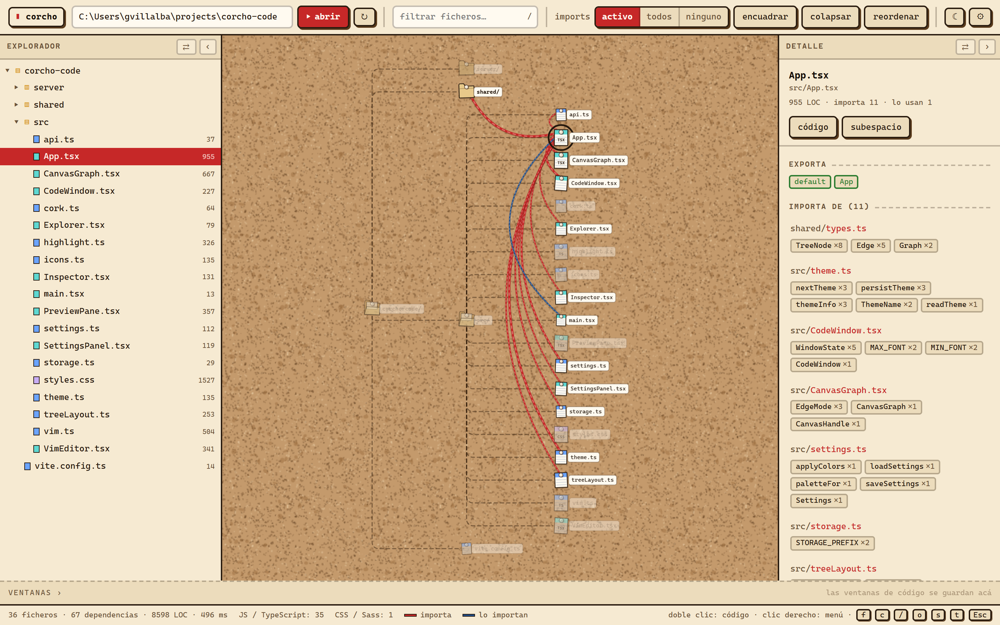
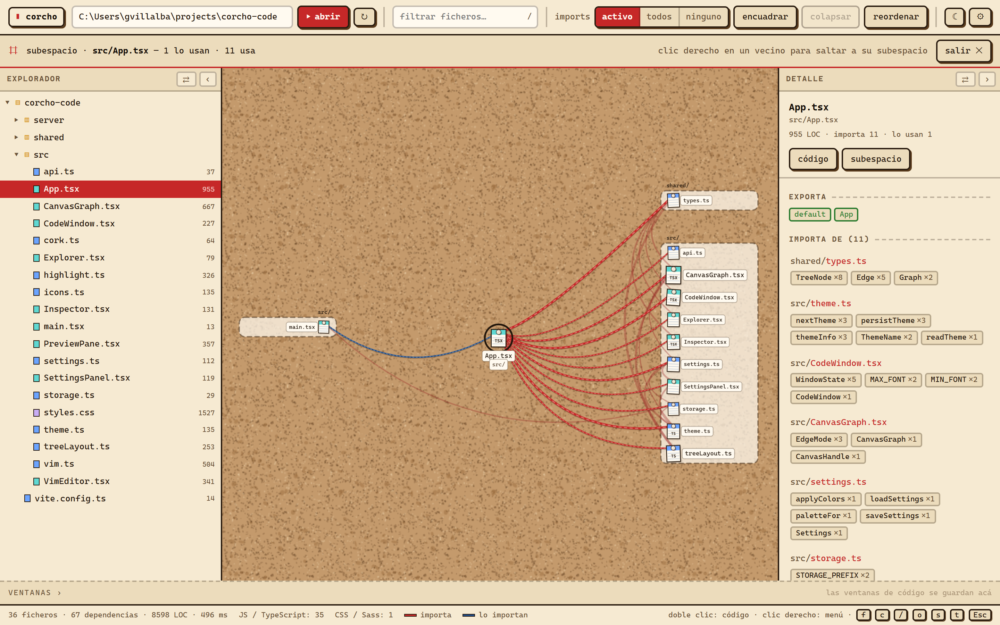
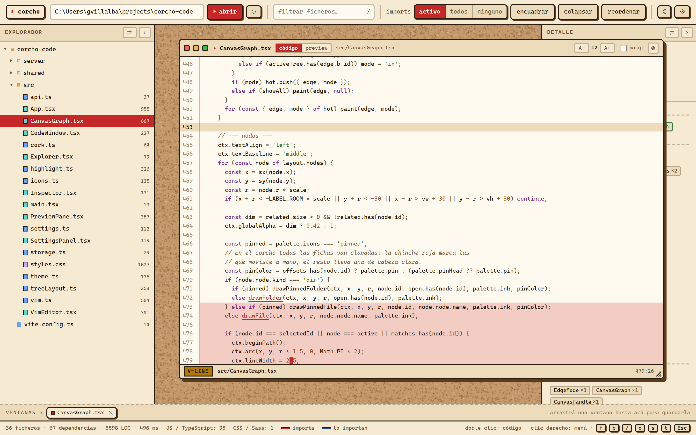

<p align="center"></p>

# corcho-code

[English](README.md) · **Español**

El nombre sale del tablero de corcho: clavás las fichas, las movés donde te sirven y las unís con hilo para ver quién depende de quién.

Visor de código como canvas: el proyecto se dibuja como un grafo de nodos sueltos —carpetas y ficheros con su icono— que podés arrastrar a mano, y encima se ven las importaciones entre ficheros y qué símbolos se usan de cada uno.

Lee JavaScript/TypeScript, C#/.NET y CSS/Sass de fábrica, y **se pueden sumar lenguajes nuevos como plugins**: cada uno implementa la interfaz `LanguageAnalyzer` en su propio módulo, sin tocar el núcleo (ver [Lenguajes](#lenguajes)).







```bash
npm install
npm run dev
```

Abre http://localhost:5173, escribí la ruta del proyecto y pulsá **Abrir**.

## Los paneles

La ventana se divide en tres: un panel a cada lado y el canvas en el medio.

- **explorador** — el árbol de directorios de siempre, en lista. Comparte el estado de carpetas abiertas con el canvas: lo que desplegás en uno se despliega en el otro. Un clic en un fichero lo selecciona, doble clic abre su código, clic derecho saca el mismo menú que en el canvas, y la fila se trae sola a la vista cuando seleccionás algo desde el lienzo.
- **detalle** — el inspector de dependencias del fichero seleccionado.

Los dos paneles se **intercambian de lado** con ⇄ y se **colapsan** a un riel angosto con ‹ / › (el riel guarda el nombre en vertical y un botón para volver a desplegarlo). La disposición se guarda en `localStorage`, así que la ventana queda como la dejaste.

## Cómo se usa el canvas

El proyecto se dibuja como un árbol ordenado: una columna por nivel, los hijos colgando de su carpeta con conectores en ángulo. Es determinista — el mismo proyecto se ve siempre igual — y no hay nodos superpuestos.

- **Arranca todo plegado**: solo se ve la raíz con su primer nivel. Vas abriendo lo que te interesa en vez de comerte el proyecto entero de golpe.
- **Clic en una carpeta**: la abre o la cierra. Cerrada, las importaciones de todo lo que hay dentro se agrupan en el propio icono de la carpeta.
- **Clic en un fichero**: lo fija en el panel de detalle.
- **Arrastrá un nodo** para moverlo de sitio: el subárbol entero viaja con él y se marca mientras lo movés. Si arrastrás una carpeta cerrada y después la abrís, sus hijos aparecen junto a ella, no en el sitio que les tocaba en el árbol original. **Doble clic** devuelve el nodo (y lo que cuelga) a su lugar, y **reordenar** devuelve todos.
- **Rueda**: zoom · **arrastrar el fondo**: pan · **encuadrar**: centra todo · **colapsar todo**: cierra todas las carpetas y vuelve al estado inicial.
- **Imports**: por defecto solo se dibujan los del nodo bajo el cursor o seleccionado — un color para lo que importa, otro para quién lo importa, y el resto se apaga. En la barra podés cambiarlo a *todas* o *ninguna*. El grosor de la arista va con la cantidad de usos.
- El panel de detalle lista los símbolos concretos de cada dependencia con cuántas veces se usan (`db ×6`), qué exporta el fichero y qué imports quedaron fuera del proyecto. Clic en una dependencia y el canvas abre la carpeta que la contiene y va hasta ella.

### Subespacio

Para ver de qué depende un fichero sin abrir media estructura: seleccionalo y pulsá **subespacio** (o el botón del panel de detalle). El canvas pasa a mostrar solo ese fichero en el centro, quién lo usa a la izquierda y lo que usa a la derecha. Entre los vecinos también se dibujan sus relaciones, en gris.

Cada columna va **agrupada por directorio**: los ficheros que viven en la misma carpeta quedan juntos en una banda con la ruta de la carpeta como cabecera, y debajo solo el nombre del fichero. Así se ve de un vistazo si una dependencia está desparramada por medio proyecto o concentrada en un par de carpetas.

El subespacio no toca el árbol: al pulsar **salir** volvés exactamente al estado anterior — las mismas carpetas abiertas y los mismos nodos donde los dejaste. Con el clic derecho sobre un vecino saltás a *su* subespacio, así se puede seguir una cadena de dependencias sin perderse.

### Ventanas de código

Con un fichero seleccionado, **código** (o «ver código» en el panel) lo abre en una ventana flotante: se arrastra por su barra de título, se redimensiona por la esquina y se puede abrir cuantas quieras a la vez para comparar.

Los controles siguen la convención de macOS: **semáforo arriba a la izquierda** —rojo cierra, amarillo minimiza a la barra, verde va y vuelve de pantalla completa, con el glifo apareciendo al pasar el mouse— y **fijar arriba a la derecha**.

- Numeración de línea siempre visible, con el margen fijo al hacer scroll.
- **Zoom de la letra** por ventana: los botones `A−`/`A+` de la barra de título o **Ctrl + rueda** sobre el código, entre 9 y 24 px.
- **wrap** por ventana para cortar o no las líneas largas.
- **Minimizar** guarda la ventana en la barra de abajo sin perder su tamaño, posición, zoom ni scroll.
- **Fijar** (◎ / ◉, arriba a la derecha) deja esa ventana por encima de las demás aunque hagas clic en otra. Útil para tener el fichero de referencia siempre a la vista mientras abrís otros.
- Coloreado de sintaxis propio, sin dependencias (`highlight.ts`), con un léxico para JS/TS y otro para hojas de estilo: pasar un `.css` por el de JS convertía la primera `url(/img/a.png)` en una expresión regular y se comía media hoja.
- **Las conexiones van marcadas en el código**: cada identificador que viene de otro fichero aparece resaltado y subrayado, con la ruta de origen en el tooltip; Ctrl+clic abre ese fichero en otra ventana. Lo que exporta el propio fichero va en otro color. Así se sigue una función hasta donde está definida sin salir del canvas. En una hoja de estilo el papel del identificador lo hacen `$gap`, `--brand` o el mixin de un `@include`: Ctrl+clic abre el parcial donde está definido.

### Edición con teclas de vim

**La vista de código es el editor**: no hay un modo de solo lectura aparte. La ventana tiene dos pestañas, *código* (vim) y *preview*. El editor se queda con **todas** las teclas mientras tiene el foco: Ctrl+R, Ctrl+S, Ctrl+F, Ctrl+P, Ctrl+D y Ctrl+U son del editor y no recargan, buscan ni imprimen.

El **mouse maneja el cursor de vim**: un clic lo lleva a ese carácter y seleccionar arrastrando entra en modo visual con esa misma selección, así que después podés operar con `d`, `y` o `c` sobre lo que marcaste con el mouse. La selección nativa del navegador se limpia sola: manda el resaltado de vim.

**Ctrl+clic** sobre un identificador conectado abre el fichero de origen —el clic pelado mueve el cursor— y **`gf`** hace lo mismo con el símbolo bajo el cursor, como en vim.

Lo que hay implementado:

- **Movimiento**: `h j k l`, `w b e`, `0 ^ $`, `gg`, `G`, `{n}G`, Ctrl+D / Ctrl+U, con conteo (`3w`, `5j`).
- **`gf`**: abre el fichero del que viene el símbolo bajo el cursor.
- **Inserción**: `i a I A o O`, Esc para volver a normal.
- **Operadores** con movimiento y conteo: `d`, `c`, `y` (`dw`, `d$`, `2dd`, `cw`, `yy`…), más `x D C s J r{char}` y `p` / `P`.
- **Visual**: `v` y `V`, con `d`, `c`, `y`, `x`.
- **Deshacer / rehacer**: `u` y Ctrl+R.
- **Búsqueda**: `/patrón`, `n`, `N`.
- **Comandos**: `:w`, `:q`, `:q!`, `:wq`, `:x`, `:noh`, `:{número}`.

La barra de estado muestra el modo, el fichero, si hay cambios sin guardar (`[+]`, también con un punto en el título de la ventana), la posición y las teclas a medio comando.

`:w` **escribe en disco de verdad** — es la única operación de la app que modifica el proyecto, vía `PUT /api/file`, acotada a la carpeta abierta. Tras guardar, el grafo no se recalcula solo: usá ↻ para volver a analizar.

Lo que **no** está: macros, marcas, `.`, registros con nombre, texto-objetos (`ciw`, `di(`), reemplazo global (`:s`) y ventanas partidas.

### Preview de componentes

En un fichero `.tsx` / `.jsx` la pestaña **preview** compila el componente con esbuild —usando las dependencias reales del proyecto, su propio `node_modules`— y lo monta en un iframe aislado. Debajo aparece un panel con **sus props**, sacadas del AST:

- una unión de literales (`'sm' | 'md' | 'lg'`) se ofrece como desplegable,
- `boolean` como casilla, `number` como numérico, `string` como texto,
- lo demás como JSON, y las funciones se listan pero no se editan,
- los valores por defecto del destructuring se usan como valor inicial.

Cambiar cualquier campo re-renderiza el componente al instante. El fondo del lienzo se conmuta entre claro y oscuro para ver cómo se comporta en ambos, y el damero de atrás delata si el componente trae fondo propio.

**Los estilos globales del proyecto se aplican de verdad.** Un componente con clases de Tailwind no se ve con solo empaquetar su JS: las utilidades viven en el CSS que genera el build. El preview busca el CSS que carga la app —siguiendo el `<script type="module">` del `index.html` hasta sus `import './x.css'`— y lo compila con la herramienta del propio proyecto:

- **Tailwind v4**: con el `@tailwindcss/node` y el scanner `oxide` del proyecto (entrando por `@tailwindcss/vite` cuando pnpm no los expone directo). Si la hoja no declara `@source`, se escanea `src/` para extraer las clases usadas.
- **Tailwind v3 / PostCSS**: por el `postcss` del proyecto con su config.
- **CSS a secas**: se empaqueta con esbuild, resolviendo `@import` y `url()`.

También se enlazan las hojas externas del `index.html` (fuentes, iconos). La casilla **estilos** apaga todo esto para ver el componente pelado, y al lado se indica qué motor se usó y cuántas hojas se aplicaron.

La detección de componentes indexa **todas** las declaraciones del fichero y después mira qué se exporta, así que reconoce el patrón habitual de declarar el componente suelto y exportarlo al final envuelto:

```tsx
const Screen = () => { … }
export default observer(Screen)   // también memo, forwardRef, connect…
```

**React Native también se previsualiza.** El runtime lo pone Corcho: trae su propio `react-native-web` y redirige ahí `'react-native'`, sin tocar el proyecto. React y react-dom se fuerzan a una única copia — con dos, los hooks explotan.

Lo que no puede correr en un navegador se **sustituye por un doble**: envoltorios de módulos nativos, SDKs de plataforma, navegación, i18n, assets que no existen y cualquier import que el bundler no logre resolver. Cada componente sustituido se dibuja como una caja punteada con su nombre, los hooks devuelven un objeto que responde a todo y las funciones devuelven su primer argumento (así `t('clave')` pinta la clave). La barra dice cuántos módulos se sustituyeron y el tooltip los lista. Si aun así el build falla, se reintenta aislando **todas** las dependencias externas: se pierde lo que aporten las librerías, pero el JSX y los estilos del componente siguen siendo los de verdad.

Los alias de `babel-plugin-module-resolver` (`components/ui/Button`) se resuelven contra `src/` antes de darse por vencido, así que los componentes propios del proyecto entran de verdad, no como huecos.

### Hojas de estilo

esbuild no trae Sass, así que un proyecto con `.scss` moría con «No loader is configured for .scss files». El preview las compila con el `sass` del propio proyecto (y con el nuestro como respaldo, si no lo tiene) y convierte cada hoja en un módulo JS que hace dos cosas: inyecta el CSS en el documento y exporta el mapa de clases, que es lo que necesita un `import styles from './x.module.scss'`.

Las clases no se renombran —el preview monta un componente solo, no hay colisiones que evitar— y el mapa devuelve el nombre tal cual para cualquier clase que no encuentre, así una hoja incompleta no rompe el render. Lo que no se pueda compilar (`.less`, `.styl`, un `@use` roto) se salta con aviso en la barra en vez de tumbar el build.

### Armazón de la app

Un componente que usa `useLocation`, `Link` o `useNavigate` explota si no hay un Router arriba, y eso no dice nada del componente: es contexto que en la app real pone el arranque. Si el proyecto tiene `react-router-dom`, el preview envuelve lo que renderiza en un `MemoryRouter` por su cuenta, y lo avisa en la barra para que quede claro que ese contexto lo puso él y no el componente.

### Proveedores del proyecto

Una pantalla que necesita store, i18n o tema falla al montarse suelta. Para eso, un fichero opcional en la raíz del proyecto:

```tsx
// corcho.preview.tsx
export function Providers({ children }) {
  return <StoreProvider>{children}</StoreProvider>;
}
```

El preview envuelve con eso todo lo que renderiza. Si no existe y el componente falla, el propio error explica cómo crearlo. Para el resto de los casos —dependencias sin instalar, un alias que esbuild no resuelve— el error de compilación se muestra tal cual, que suele ser justo lo que hace falta saber.

### La barra de ventanas

Abajo del todo hay una barra donde viven todas las ventanas de código abiertas. Sirve para no tapar el canvas cuando abrís muchas:

- **Arrastrá una ventana hasta la barra** y se guarda ahí (la barra se ilumina mientras la traés). El botón amarillo hace lo mismo.
- Cada ventana es una ficha: punto lleno si está abierta, hueco si está guardada. Un clic la restaura o la trae al frente; la ✕ la cierra.
- **Arrastrá las fichas de costado** para ordenarlas, o **hacia arriba** para sacar esa ventana de la barra y dejarla donde sueltes.

### Menú contextual

Clic derecho sobre un fichero, una carpeta, el fondo del canvas o una ventana de código. Cambia según lo que haya debajo: ver código, ver en subespacio, centrar, abrir todo lo de dentro, copiar ruta, encuadrar, colapsar, minimizar, pantalla completa, zoom de la letra, cerrar las demás. **Doble clic sobre un fichero abre su código** directamente.

### El filtro

Escribí en el campo de filtro y el canvas pasa a mostrar **solo** los ficheros que coinciden, con las carpetas que llevan hasta ellos abiertas. El contador de la derecha dice cuántos son y limpia el filtro de un clic (o <kbd>Esc</kbd>).

El filtro no toca el estado del árbol: al limpiarlo vuelve exactamente a las carpetas que tenías abiertas antes.

### Lo que se guarda

En `localStorage`: la disposición de los paneles y el tema, y por proyecto las carpetas abiertas, las ventanas de código —con su posición, tamaño, zoom de letra, wrap, si están fijadas y si están guardadas en la barra— y el modo de imports. Al reabrir el mismo proyecto todo vuelve como lo dejaste; lo que ya no existe en disco se descarta solo. El tema se guarda aparte, porque no depende del proyecto.

Los iconos: carpeta cerrada / carpeta abierta, y una hoja por fichero con el color y la etiqueta de su tipo (TS, TSX, JS, JSX, CSS…). El tamaño del nodo de fichero va con sus líneas de código.

## Configuración

El botón ⚙ de la barra abre el panel de preferencias. Se aplica en vivo y se guarda en `localStorage` (`corcho:settings`).

**Tema**: corcho, oscuro o claro, con un selector. Es lo mismo que el botón de la barra y la tecla <kbd>t</kbd>, pero sin tener que recorrer los tres.

**Trazo de las aristas**, con dos opciones:

- **curvas** — el trazo suelto de siempre, cómodo cuando los nodos están lejos.
- **ortogonales** — tramos rectos con esquinas redondeadas: la arista sale horizontal del origen, sube o baja por un canal vertical y entra horizontal al destino, como un diagrama. Si origen y destino están casi en la misma columna, el canal se corre a la derecha de los dos para no pasar por encima de los iconos.

Cada nodo origen tiene **su propio carril**, y la vuelta atrás entre el mismo par usa media calle más. Sin eso todas las aristas bajaban por la misma columna y se tapaban: se veían tres líneas donde había quince. En modo curvas, el carril también varía la panza del trazo por el mismo motivo.

**Colores**, con selector y campo hexadecimal por cada uno: acento (que también pinta las aristas de «importa»), «lo importan», fondo, paneles, texto, exports y coincidencias. Cada tema guarda su propio juego —lo que funciona en oscuro no funciona en claro— y lo que no toques sigue al tema. Cada fila tiene su ↺ para volver al valor original, y abajo hay un restablecer general.

Los colores viajan a los dos lados: se escriben como variables CSS en el documento y se vuelcan sobre la paleta del lienzo, que no puede leer CSS.

## Aspecto

El estilo es **terminal · cartoon · minimalista**: todo en monoespaciada, contornos gruesos, sombras duras sin difuminar, colores planos y una sola familia de acentos. Los iconos del lienzo llevan el mismo trazo negro que los botones, así el canvas y la interfaz se leen como una sola cosa.

El estilo cartoon vive de dos cosas: el contorno y la sombra dura. Son dos colores distintos, no uno. El contorno es tinta oscura en todos los temas, porque va sobre rellenos claros (iconos, semáforo, insignias). La sombra, en cambio, tiene que contrastar contra el **fondo**: negra sobre papel en el tema claro, y un gris azulado más claro que el fondo en el oscuro — si fuera negra, no se vería nada.

Hay tres temas, que se recorren con el botón de la barra o la tecla <kbd>t</kbd> (el botón muestra el glifo del siguiente):

- **corcho** (el predeterminado) — el tablero que le da nombre a la app. El lienzo es corcho de verdad, con textura generada (una baldosa con gránulos, siempre la misma gracias a una semilla fija); los ficheros son fichas de papel apenas torcidas (una franja con el color y el tipo, y renglones) y las carpetas son carpetas manila, todas clavadas con una chinche — roja en los nodos que moviste a mano. Con aristas curvas, los imports son hilo que cuelga de chinche a chinche y se arquea hacia un costado entre fichas de la misma columna; los resaltados son rojos o azules, con hebras y sombra sobre el corcho. Los conectores del árbol pasan a una línea de lápiz cortada y los nombres van en etiquetas de papel. Paneles y barra son papel kraft.
- **oscuro** — pantalla de terminal.
- **claro** — papel.

La elección se guarda en el navegador; sin elección guardada, arranca en corcho.

El lienzo no puede leer variables CSS mientras pinta, así que la paleta vive dos veces, en `styles.css` y en `theme.ts`, con los mismos nombres.

### Atajos

| tecla | acción |
| --- | --- |
| <kbd>f</kbd> | encuadrar |
| <kbd>c</kbd> | colapsar todo |
| <kbd>r</kbd> | reordenar los nodos movidos |
| <kbd>/</kbd> | ir al filtro |
| <kbd>o</kbd> | abrir el código del fichero seleccionado |
| <kbd>s</kbd> | subespacio del fichero seleccionado |
| <kbd>t</kbd> | cambiar de tema (corcho → oscuro → claro) |
| <kbd>Esc</kbd> | salir de pantalla completa → del subespacio → de la selección |

## Cómo está armado

```
server/          API local que analiza el proyecto
  analysis/      el contrato: interfaz de analizador y registro de plugins
  languages/     un módulo por lenguaje (typescript.ts, csharp.ts, stylesheet.ts)
  scan.ts        recorre el árbol preguntándole al registro qué ficheros valen
  analyze.ts     parseo sintáctico con el compilador de TypeScript
  resolve.ts     resuelve especificadores a ficheros reales (extensiones, index,
                 baseUrl y paths del tsconfig, `./foo.js` -> `foo.ts`, parciales
                 de Sass); cada lenguaje le pasa sus reglas
  graph.ts       arma el árbol y las aristas, sin saber de lenguajes
  components.ts  detecta componentes exportados y sus props (AST)
  preview.ts     empaqueta un componente con esbuild para el preview
  styleLoader.ts compila CSS, Sass y CSS Modules para el preview
  styles.ts      compila el CSS global del proyecto (Tailwind v4/v3, postcss)
src/              la interfaz
  Explorer.tsx    árbol de directorios del panel lateral
  treeLayout.ts   árbol ordenado (una columna por nivel, hojas en filas
                  consecutivas, carpetas centradas sobre sus hijos) y el
                  layout de tres columnas del subespacio
  icons.ts        dibujo de los iconos de carpeta y de fichero
  theme.ts        paletas del lienzo y ciclo de temas
  cork.ts         textura de corcho generada para el tema corcho
  settings.ts     preferencias: colores propios y trazo de las aristas
  SettingsPanel.tsx  el panel de configuración
  highlight.ts    tokenizadores propios de JS/TS y de hojas de estilo, para
                  colorear y detectar nombres
  CodeWindow.tsx  ventana flotante de código: arrastre, resize, foco y wrap
  vim.ts          motor de vim (función pura: tecla + estado -> estado)
  VimEditor.tsx   editor con el motor de vim y la línea de estado
  PreviewPane.tsx render del componente en un iframe + panel de props
  CanvasGraph.tsx render en canvas 2D, zoom/pan, arrastre y resaltado
  Inspector.tsx   panel de dependencias del fichero seleccionado
```

El análisis es **sintáctico**, no hace chequeo de tipos: por eso un proyecto mediano se analiza en cientos de milisegundos. La contrapartida es que los usos se cuentan por nombre del identificador, así que una variable local con el mismo nombre que un import inflaría la cuenta.

## Lenguajes

El núcleo no sabe de lenguajes. Define una interfaz —`LanguageAnalyzer` en `server/analysis/types.ts`, junto a quien la consume— y cada lenguaje la implementa en su propio módulo, registrado en `server/languages/index.ts`. `graph.ts` reparte los ficheros entre los analizadores y no conoce a ninguno.

El contrato va en **dos fases**, y esa es la decisión de diseño que importa:

1. `parse(fichero)` saca hechos de un fichero mirándolo solo a él.
2. `link(contexto)` recibe el proyecto entero ya indexado y recién ahí produce las aristas.

Hace falta así porque no todos los lenguajes resuelven igual. En JS/TS un import apunta a una ruta y se resuelve con el fichero delante. En C# no: `using Foo.Bar` nombra un espacio de nombres repartido en muchos ficheros, y dos tipos del mismo namespace ni siquiera necesitan `using`. Ahí la dependencia se deduce al revés —qué tipo declara cada fichero, qué tipos usa cada uno— y para eso hay que tener todo indexado antes.

| lenguaje | extensiones | cómo saca las aristas |
| --- | --- | --- |
| **JS / TypeScript** | `.ts .tsx .js .jsx .mjs .cjs .mts .cts` | AST del compilador de TS; el especificador se resuelve a un fichero (extensiones, `index`, `baseUrl` y `paths` del tsconfig) |
| **C# / .NET** | `.cs` | índice de tipo declarado → fichero, y después qué tipos usa cada uno; los `using` que no caen en un namespace del proyecto quedan como externos |
| **CSS / Sass** | `.css .scss .sass .less .styl` | `@use`, `@forward`, `@import` y el `composes` de CSS Modules; los símbolos salen de cruzar lo que la hoja destino ofrece con lo que la de origen usa |

Para sumar uno nuevo: implementar la interfaz y agregarlo a la lista de `registerBuiltinLanguages()`. El plugin declara también qué directorios ignorar (`node_modules` para JS, `bin`/`obj` para .NET) y qué ficheros descartar (`.d.ts`, `*.Designer.cs`, `*.min.css`), así que el scanner tampoco tiene reglas por lenguaje.

Las **hojas de estilo son nodos como cualquier otro**: importan y las importan. Una hoja depende de otras por `@use`, `@forward`, `@import` o el `composes` de CSS Modules, y a su vez es dependencia del módulo que la trae —esa arista la pone el analizador de JS/TS, que resuelve `./App.css` contra el proyecto entero en vez de darlo por externo—. Así un `.tsx` conecta con su `.module.scss`, ese `.scss` con el `_index.scss` de los tokens y ese con cada parcial, que es el recorrido que antes había que hacer a mano.

El detalle de la arista cuesta más que en JS, porque `@use "variables"` no dice qué trae: hay que deducirlo. Cada hoja publica lo que ofrece —`$variables`, `--custom-properties`, `@mixin`, `@function`, clases y placeholders— y el enlace cruza eso con lo que la otra usa. Un `_index.scss` que solo hace `@forward` ofrece lo de los ficheros que reenvía, así que quien lo usa ve los nombres de verdad y no un fichero vacío. La resolución imita a la del compilador: parciales con `_` y `_index.scss` de un directorio. Un especificador suelto —`variables`, `src/styles/mixins`— se busca en cada directorio desde el fichero que lo pide hacia arriba: las loadPaths de verdad viven en la config del bundler, y la convención es que cuelgan de la raíz del paquete, que en un monorepo no es la raíz de lo que estás mirando. Lo que queda fuera del árbol —`tailwindcss`, `~bootstrap/…`, `sass:math`, una hoja de Google Fonts— aparece como externo, igual que un paquete de npm.

Los alias de bundler que viven en `vite.config.ts` o en el webpack del proyecto no se leen: si un `@use "@estilos/tema"` no cae en el `tsconfig`, queda como externo.

Sobre C# en particular: el parser quita comentarios y literales, y después reconoce `namespace`, `using` (incluidos `static`, alias y `global`), las declaraciones de `class`/`interface`/`struct`/`enum`/`record` —también las anidadas y las `partial`, que enlazan a todos sus ficheros— y cuenta los identificadores en PascalCase como candidatos a tipo. Es una heurística de convención, no un compilador: un tipo que se llame igual que otro de otro namespace puede generar una arista de más, y las llamadas por reflexión o por inyección de dependencias no aparecen.

## Estado

Primer hito: árbol navegable con iconos, carpetas que se abren y cierran, nodos movibles, subespacio de relaciones, ventanas de código con las conexiones marcadas, y aristas de import con detalle de símbolos.

Lo que sigue natural desde acá:

- Nivel de funciones dentro del fichero al hacer zoom (el parser ya tiene el AST).
- Java, Python y PHP: son otro `LanguageAnalyzer` cada uno, sin tocar el núcleo.
- Empaquetar como app de escritorio con Tauri: el server ya está aislado del UI.
